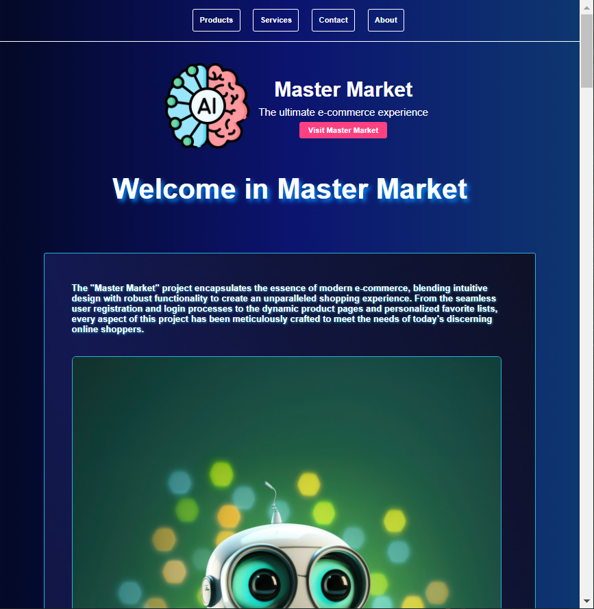
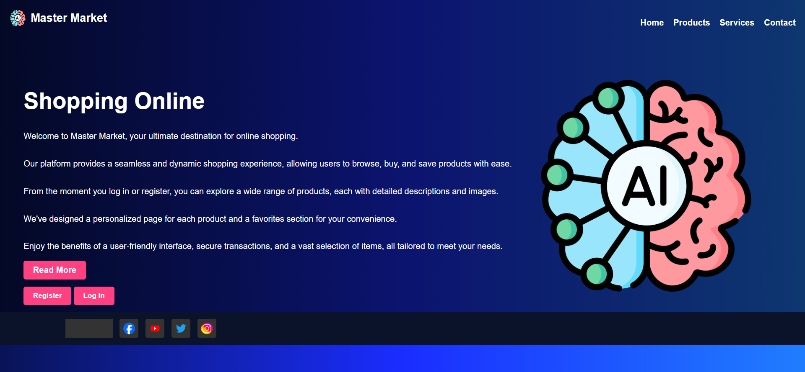
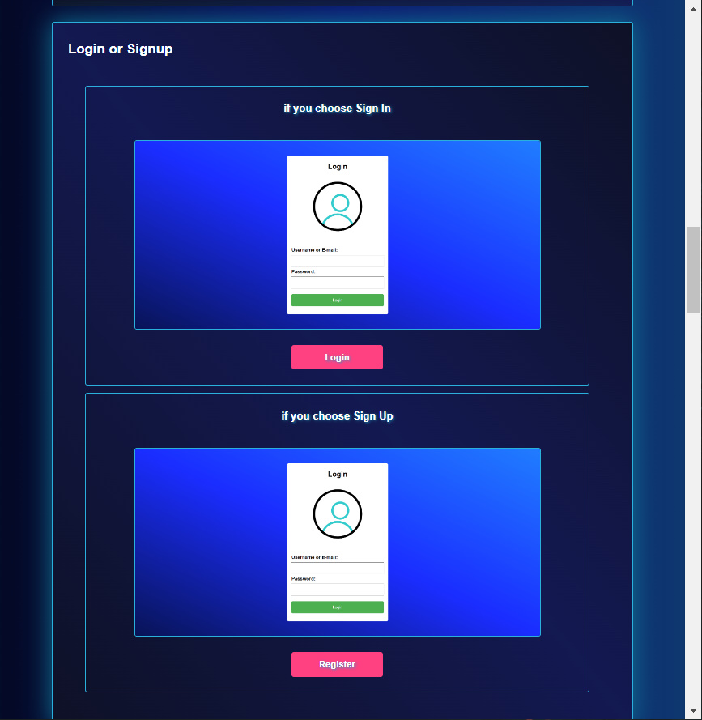
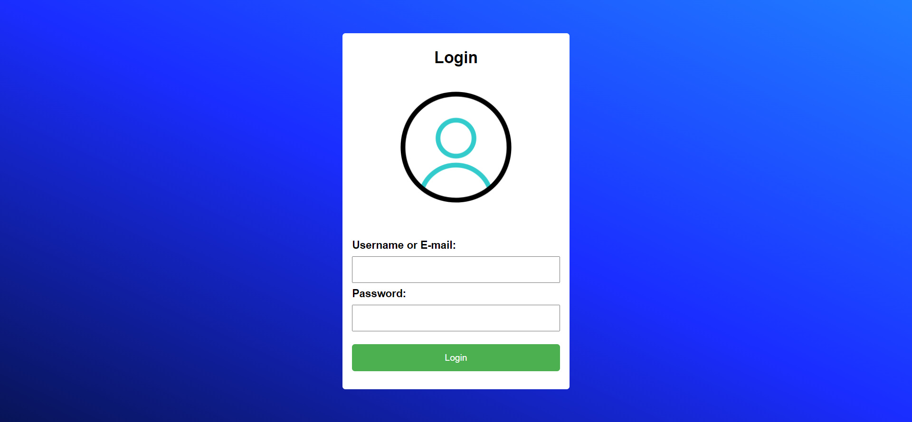
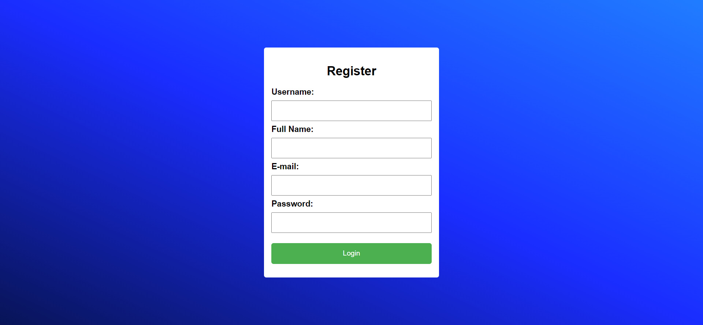

# Master Market



## Table of Contents
1. [Introduction](#introduction)
2. [The Story](#the-story)
3. [Key Features](#key-features)
4. [Technologies Used](#technologies-used)
5. [Installation](#installation)
6. [Usage](#usage)
7. [Contributing](#contributing)
8. [Related Projects](#related-projects)
9. [Licensing](#licensing)
10. [All Static pages](#all-static-pages)
11. [All Dynamic pages](#all-dynamic-pages)

## Introduction
Welcome to Master Market, the ultimate e-commerce experience. This project is designed to provide a seamless shopping experience with a user-friendly interface and robust backend.


- **Deployed Sites**: [Master Market Live](https://abdallahm19.github.io/Master_market/templates/landing_page.html)
- **Final Project Blog Article:** [Project Blog](#)
- **Author's LinkedIn:** [LinkedIn Page](https://www.linkedin.com/in/abdallah-mohamed-628416289/)

---

## ***The Story***


At first, I was required to do a project and had a few options to consider. However, an idea struck me suddenly: why not create a website that integrates artificial intelligence into its functionality? I noticed that many marketing sites do not leverage AI services, and I thought, **"Why not create a marketing site similar to Amazon, but with AI capabilities?"**

The challenge, though, was that I had only two weeks to complete the project. To add to the difficulty, I am a nursing student, and **my final exams were scheduled to start in the second week of the project timeline.** This tight schedule left me feeling frustrated and contemplating whether I should simplify the project to make it more manageable. But I decided to push through and commit to creating the AI-powered marketing site, regardless of the time constraints and hard work involved.

I was aware that completing the project within the given time frame would be tough, but I resolved to do my best and produce as much as I could. I began by organizing my time and breaking down the project into manageable parts.

Initially, I thought about developing the front-end and back-end simultaneously, but I realized that this approach might lead to compatibility issues. Therefore, I decided to start with the back-end development first.

I focused on building the core functionalities related to the products:

- Adding a product.
- Modifying product data.
- Displaying all existing products.
- Deleting a product.

I was thrilled to complete this part in less than four days, with everything working perfectly and the data stored in a JSON file.

Next, I moved on to the user-related functionalities:

- Creating user accounts.
- Implementing the login system.
- Managing user sessions and authentication.

The third part involved cart management functionalities for users:

- Adding products to the user's cart.
- Calculating the total price of products in the cart.
- Removing products from the cart.

I was delighted to finish this part as well, and it all worked seamlessly with MySQL, storing data effectively. By the end of the first week, I had completed the back-end development, which was a significant milestone.

Despite the challenges, including my exam preparations, I managed to build a functional back-end within a week. This experience taught me valuable lessons about time management, perseverance, and the importance of breaking down complex tasks into smaller, achievable goals.

**The second part of the project focused on the front-end development.** By this time, the second week had started, **and I had three exams to prepare for and complete.** This period was exceptionally challenging as I had to balance my academic responsibilities with the demands of the project. Despite the heavy workload, I dedicated whatever time I could to work on the front-end.

I developed the user interface, ensuring it was intuitive and user-friendly. The front-end needed to interact smoothly with the back-end, displaying product information, user details, and cart contents accurately. This involved a lot of testing and debugging to ensure everything functioned as expected.

Throughout the second week, I often felt that the project was incomplete and far from my original vision. **The pressure of exams and the complexity of integrating AI features left me feeling overwhelmed at times**. However, I persevered, knowing that even if the project wasn't perfect, it was a significant learning experience and a step towards achieving my goal.

Despite the challenges, I managed to create a functional front-end that met the basic requirements. I knew there was much more to be done, and the site needed further improvements to fully realize its potential. However, **I took pride in what I had accomplished within such a short period.**

This project taught me invaluable lessons about time management, problem-solving, and the importance of perseverance. It also deepened my understanding of web development and artificial intelligence, fueling my passion for creating innovative solutions. **I look forward to continuing to develop Master Market, adding more features, and refining its capabilities to create a truly remarkable e-commerce platform.**

> ***"A person does not drown because he falls into the river, but because he remains submerged under the water."***  
> — **Paulo Coelho**


---

## Key Features

### Current Features
- Log in if you already have an account
- Or create a new account
- You cannot create a new account if the email or username already exists and both must be changed. You will know what is duplicated in the error message below the registration button
- You can search for the product you want in the search box
- You can make a star on the product you prefer. At the bottom of each product you will find a star button. Click on it until it turns orange.

---

### And work on adding many features including:

- Adding a product.
- Adding images of the product.
- Creating a page for each product with all the details in a better way.
- Creating a page with all the products you preferred.
- Creating a page with all the products you added to the shopping cart.
- Separating each user from the other and making each one of them his own page and own account.
- Creating a page with the user's data (including his name and photo) - Profile page

---

#### Remember: [run app dynamic](#usage) to work and can register or login in master market.

---
### User Authentication

#### **Secure Login**: Users can securely log in using their email and password.

#### **Registration**: New users can sign up by providing their details.


### Home page
- you can use search box and search about any product.
- you can make star (to add product to favorite list).[ i work on this feature.]
- If you want to go to the Master Market page, click on the logo at the top left of the page. 

### Product Catalog

- **Browse Products**: Users can browse through a wide range of products with detailed descriptions and images.

### Search Functionality

- **Quick Search**: Users can quickly find products using the search bar.

### Responsive Design
- **Mobile-Friendly**: The application is designed to work seamlessly on mobile devices.
- **Cross-Browser Compatibility**: Works well on all major browsers.
- **Adaptive Layouts**: Adjusts to different screen sizes and resolutions.

---

## Technologies Used
- **Python**: The core programming language used for developing the application.
- **Flask**: A micro web framework used for routing, handling HTTP requests, and rendering templates.
- **MySQL**: A relational database management system used to store and manage data.
- **SQLAlchemy**: An ORM (Object-Relational Mapping) library for Python used to interact with the MySQL database.
- **HTML/CSS**: Markup and styling languages used for designing the front-end of the application.
- **JavaScript**: Used for enhancing interactivity on the front-end.
- **Jinja2**: A templating engine for Python used to generate HTML dynamically.
- **requests**: A Python library used for making HTTP requests.
- **Werkzeug**: A comprehensive WSGI web application library used by Flask.
- **Jinja2**: A templating engine used in Flask for dynamic web page generation.

---

## Installation
To get a local copy up and running follow these simple steps.

1. **Clone the repo:**
    ```sh
    git clone https://github.com/AbdallahM19/Master_market.git
    ```
2. **Navigate to the project directory:**
    ```sh
    cd Master_market
    ```
3. **Install dependencies:**
    ```sh
    pip install -r requirements.txt
    ```
    + [requirements.txt](./requirements.txt)
4. **Set up the database:**
    - Ensure you have MySQL installed and running.
    - Create a database named `master_market_db`.
    - Import the database schema from the [`schema.sql`](./schema.sql) file.
    - Alternatively, you can skip this step as the app will create the database and tables and insert data.
5. **Run the application:**
    ```sh
    python app_dynamic.py
    ```

---

## Usage
Once the application is running, open your browser and navigate to `http://127.0.0.1:5000/` to start using Master Market.

1. **Run Master Dynamic**
    ```
    python app_dynamic.py
    ```
2. **Run Backend Master Market**
    ```
    python app.py
    ```

---

## Contributing
Contributions are what make the open source community such an amazing place to learn, inspire, and create. Any contributions you make are **"*greatly appreciated*"**.

#### **"*Contributing to a project*"**: [Learn how to contribute to a project through forking.](https://docs.github.com/en/get-started/exploring-projects-on-github/contributing-to-a-project)

1. **Fork the Repository:**
   - Click on the "Fork" button on the top right corner of this page.
   
2. **Clone the Repository:**
   - Clone your forked repository to your local machine.
     ```sh
     git clone https://github.com/your-username/master-market.git
     ```

3. **Create a New Branch:**
   - Move into the repository's directory.
     ```sh
     cd Master_market
     ```
   - Create a new branch with a descriptive name.
     ```sh
     git checkout -b new-branch
     ```

4. **Make Changes:**
   - Make your desired changes to the codebase.

5. **Commit Changes:**
   - Add your changes to the staging area.
     ```sh
     git add .
     ```
   - Commit your changes with a descriptive message.
     ```sh
     git commit -m "Add your commit message here"
     ```

6. **Push Changes:**
   - Push your changes to your forked repository.
     ```sh
     git push origin new-branch
     ```

7. **Submit a Pull Request:**
   - Go to the GitHub website and navigate to your forked repository.
   - Click on the "New Pull Request" button.
   - Provide a descriptive title and summary for your pull request.
   - Click on "Create Pull Request" to submit your contribution for review.

Thank you for considering contributing to Master Market! Your help is greatly appreciated.

---

## All Static pages
<h3>
<a href="https://abdallahm19.github.io/Master_market/">GitHub Page</a>
</h3>
<h3>
<a href="https://abdallahm19.github.io/Master_market/templates/home.html">Master Market Page</a>
</h3>
<h3>
<a href="https://abdallahm19.github.io/Master_market/templates/home_login.html">Master Market Page and login button</a>
</h3>
<h3>
<a href="https://abdallahm19.github.io/Master_market/templates/landing_page.html">Landing Page</a>
</h3>
<h3>
<a href="https://abdallahm19.github.io/Master_market/templates/master_market.html">Home Page</a>
</h3>
<h3>
<a href="https://abdallahm19.github.io/Master_market/templates/master_market_img.html">Home Copy Page</a>
</h3>

---

## All Dynamic pages
<h2>
<a href="https://abdallahm19.github.io/Master_market/dynamic_templates/master_market.html">Home Page</a>
</h3>
<h3>
<a href="https://abdallahm19.github.io/Master_market/dynamic_templates/landing_page.html">Landing Page</a>
</h3>
<h3>
<a href="https://abdallahm19.github.io/Master_market/dynamic_templates/login.html">Login Page</a>
</h3>
<h3>
<a href="https://abdallahm19.github.io/Master_market/dynamic_templates/signin.html">Register Page</a>
</h3>
<h3>
<a href="https://abdallahm19.github.io/Master_market/dynamic_templates/home.html">Master Market Page</a>
</h3>

---

## Related Projects
Here are a few related projects that might interest you:
- [Airbnb Project](https://github.com/AbdallahM19/AirBnB_clone_v4)

---

## Licensing

Master Market is licensed under the MIT License. See the LICENSE file for more details.

---

## Copyright

Copyright 2024 © Master Market. All Rights Reserved.